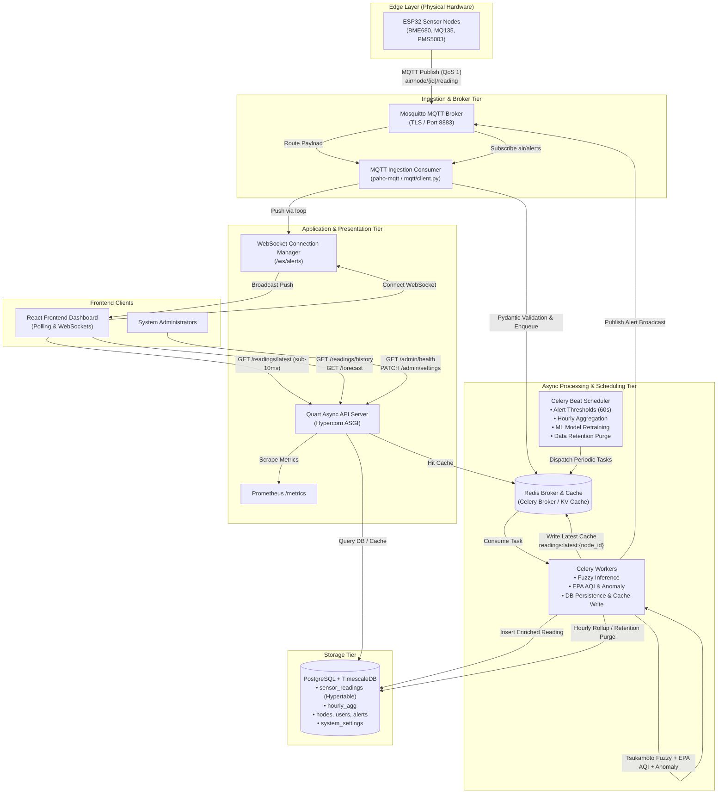

# Empyrean V2 — Comprehensive System Overview

> **Empyrean** is a real-time, geospatially-aware IoT air-quality monitoring, intelligence, and analytics platform. It ingests high-frequency telemetry from distributed edge hardware nodes, enriches the data using a Tsukamoto fuzzy inference engine and machine learning models, identifies anomalies, issues multi-channel alerts, and serves low-latency REST and WebSocket APIs to interactive web dashboards and mapping clients.

---

## 1. What is Empyrean?

Empyrean addresses the challenge of real-time environmental monitoring by bridging physical IoT sensor networks with modern cloud-grade data engineering and intelligence. Unlike simple data-logging systems, Empyrean performs multi-metric sensor fusion, comfort indexing, predictive analytics, and automated alerting at sub-second latencies.

### Core Value Propositions
* **High-Throughput IoT Ingestion:** Secure MQTT (TLS/MQTTS) pipeline capable of ingesting high-frequency telemetry across many concurrent hardware nodes with zero message loss and bounded backpressure.
* **Environmental Intelligence & Fuzzy Logic:** Evaluates air quality through both standard EPA Air Quality Index (AQI) formulas and a custom **Tsukamoto Fuzzy Inference Engine** that fuses temperature, relative humidity, and fine particulate matter ($\text{PM}_{2.5}$) into an intuitive 0–100 environmental score.
* **Predictive Forecasting & Anomaly Detection:** Automated linear regression with seasonal adjustments forecasting 60-minute future AQI trends, combined with rolling 24-hour Z-score statistical anomaly detection.
* **Real-Time Alerting & Multi-Channel Broadcasting:** Escalation-aware alert management dispatching immediate notifications over WebSockets, MQTT broadcast topics, and fail-soft SMTP email.
* **Optimized Time-Series Storage:** PostgreSQL 18 powered by **TimescaleDB** hypertables for chunked time-series storage, automated hourly aggregation roll-ups, and configurable data retention lifecycles.
* **Production-Grade Reliability & Observability:** Distributed tracing with OpenTelemetry, Prometheus metrics collection, Redis-backed task circuit breakers, strict rate limiting, and fail-soft administrative health checks.

---

## 2. System Architecture & End-to-End Data Pipeline

Empyrean operates as a distributed yet cohesive set of services running on an asynchronous, event-driven architecture.



### End-to-End Telemetry Lifecycle

| Step | Component | Action / Operation |
| :--- | :--- | :--- |
| **1. Capture** | ESP32 Sensor Node | Samples environmental conditions (temperature, humidity, pressure, gas resistance, VOCs, $\text{PM}_1$, $\text{PM}_{2.5}$, $\text{PM}_{10}$, battery voltage) and constructs a JSON payload. |
| **2. Transmit** | MQTT over TLS | Node publishes payload to topic `air/node/{node_id}/reading` with QoS 1. |
| **3. Ingest** | `mqtt/client.py` | Mosquitto routes message to the backend consumer. The authoritative `node_id` is parsed from the topic path. Pydantic validates the schema; non-finite floats ($\text{NaN}/\pm\infty$) are filtered out. |
| **4. Enqueue** | Redis Task Queue | The validated payload is dispatched asynchronously to the Celery task queue (`empyrean.tasks.process_reading`). |
| **5. Enrich** | Celery Worker | The worker executes three mathematical pipelines:<br>1. **Tsukamoto Fuzzy Inference:** Evaluates $T, H, \text{PM}_{2.5}$ against 27 rules $\rightarrow$ fuzzy comfort score ($0\text{--}100$).<br>2. **EPA AQI Engine:** Calculates standard AQI from $\text{PM}_{2.5}/\text{PM}_{10}$.<br>3. **Anomaly Detection:** Performs rolling 24-hour Z-score analysis on $\text{PM}_{2.5}$ ($Z > 3.0$). |
| **6. Persist** | TimescaleDB | The enriched record is committed to the `sensor_readings` hypertable. |
| **7. Cache Hot** | Redis Cache | The worker writes through to `readings:latest:{node_id}` (TTL 60s) and invalidates the global `readings:latest` key to ensure immediate cache freshness. |
| **8. Evaluate** | Celery Beat | Every 60 seconds, `tasks.alerts.check_thresholds` scans active nodes against dynamic warning/critical thresholds. Any breach is atomically upserted into the database. |
| **9. Broadcast** | WebSocket & Email | Alerts are published to `air/alerts` on MQTT, bridged to the thread-safe WebSocket connection manager, pushed live to web dashboards, and emailed if critical. |
| **10. Serve** | Quart API | React clients poll `GET /api/v1/readings/latest` every 5 seconds, retrieving pre-cached enriched records in $< 10\text{ ms}$. |

---

## 3. Core Subsystems Deep Dive

### 3.1. Edge Hardware & MQTT Integration (`mqtt/`)
* **Hardware Profiles:** Compatible with ESP32 microcontrollers wired to Bosch BME680 (temperature, humidity, atmospheric pressure, gas resistance), MQ135 (air quality/gas PPM), and Plantower PMS5003 / SDS011 particulate matter laser sensors.
* **Topic Taxonomy:**
  * `air/node/{node_id}/reading`: Inbound device telemetry (temperature, humidity, pressure, voc_ohm, mq135_ppm, pm1, pm25, pm10, battery_v, time).
  * `air/node/{node_id}/status`: Node lifecycle heartbeats (`online`, `offline`), firmware version reports, and IP metadata.
  * `air/node/{node_id}/config`: Outbound device configuration (e.g., dynamically adjusting `reading_interval`).
  * `air/alerts`: Outbound broadcast topic for threshold-breach alert events.
* **Security & Resilience:**
  * **Authoritative Topic Identifiers:** The `node_id` in the MQTT topic path overrides any body-supplied ID to prevent device spoofing.
  * **Bounded Worker Thread:** Ingestion I/O runs on a bounded internal queue to isolate the Paho network loop from database/queue backpressure.
  * **Fail-Closed TLS:** Refuses plaintext fallback if TLS certificates are configured but invalid.

---

### 3.2. Tsukamoto Fuzzy Inference Engine (`fuzzy/`)
The Tsukamoto Fuzzy Engine computes a unified environmental comfort/quality score in the range $[0, 100]$. Unlike standard AQI (which only measures pollution concentration), Tsukamoto fuses temperature, relative humidity, and fine particulates.

```
       ┌────────────────┐
  T ──>│ Membership Fns │── (Low, Medium, High)
       └────────────────┘                      \
       ┌────────────────┐                       \    ┌─────────────────┐      ┌───────────────────────┐
  H ──>│ Membership Fns │── (Dry, Humid, Wet)   ───> │ 27-Rule Base    │ ───> │ Tsukamoto             │ ──> Crisp Score [0, 100]
       └────────────────┘                       /    │ (Consequents)   │      │ Defuzzification       │
       ┌────────────────┐                      /     └─────────────────┘      │ Σ(αᵢ × zᵢ) / Σ(αᵢ)    │
PM2.5─>│ Membership Fns │── (Low, Medium, High)                               └───────────────────────┘
       └────────────────┘
```

#### Membership Functions
* **Temperature ($0\text{--}50\ ^\circ\text{C}$):**
  * *Low:* Trapezoidal shoulder $[0, 15]$, ramping to 0 at $35\ ^\circ\text{C}$.
  * *Medium:* Triangular ramp $15 \rightarrow 35\ ^\circ\text{C}$, plateau $[35, 40]$, ramping to 0 at $50\ ^\circ\text{C}$.
  * *High:* Ramp $40 \rightarrow 50\ ^\circ\text{C}$, plateau $[50, 50]$.
* **Humidity ($0\text{--}100\%$):**
  * *Dry:* Shoulder $[0, 30]\%$, ramping to 0 at $70\%$.
  * *Humid:* Ramp $30 \rightarrow 70\%$, plateau $[70, 80]\%$, ramping to 0 at $100\%$.
  * *Wet:* Ramp $80 \rightarrow 100\%$, plateau at $100\%$.
* **$\text{PM}_{2.5}$ ($0\text{--}500\ \mu\text{g}/\text{m}^3$):**
  * *Low:* Shoulder $[0, 50]$, ramping to 0 at $100\ \mu\text{g}/\text{m}^3$.
  * *Medium:* Ramp $50 \rightarrow 100$, plateau $[100, 200]$, ramping to 0 at $300\ \mu\text{g}/\text{m}^3$.
  * *High:* Ramp $200 \rightarrow 300$, plateau $[300, 500]\ \mu\text{g}/\text{m}^3$.

#### Rule Base & Consequents
All 27 combinations ($3 \times 3 \times 3$) map to strictly monotonic output ramps:
* **Good:** $[0, 40]$
* **Moderate:** $[30, 60]$
* **Unhealthy for Sensitive Groups (USG):** $[50, 75]$
* **Unhealthy:** $[65, 90]$
* **Very Unhealthy:** $[85, 100]$

#### Defuzzification
For each rule $i$ with firing strength $\alpha_i = \min(\mu_T, \mu_H, \mu_P) > 0$, the crisp output $z_i = \text{lo}_i + \alpha_i (\text{hi}_i - \text{lo}_i)$ is calculated. Defuzzified crisp output:
$$\text{Score}_{\text{crisp}} = \frac{\sum_{i} \alpha_i \cdot z_i}{\sum_{i} \alpha_i}$$

---

### 3.3. EPA AQI & Statistical Anomaly Detection (`tasks/aqi.py`, `tasks/process_reading.py`)
* **EPA Air Quality Index:** Computes standard AQI based on official EPA breakpoints for $\text{PM}_{2.5}$ and $\text{PM}_{10}$. Determines both the integer AQI score ($0\text{--}500+$) and categorical designation (*Good, Moderate, Unhealthy for Sensitive Groups, Unhealthy, Very Unhealthy, Hazardous*).
* **Z-Score Anomaly Detection:** Compares incoming $\text{PM}_{2.5}$ measurements against the node's rolling 24-hour historical window (up to 2,880 samples):
  $$Z = \frac{|\text{PM}_{2.5} - \mu_{24\text{h}}|}{\sigma_{24\text{h}}}$$
  If $Z > 3.0$ (and sample count $N \ge 5$ with $\sigma > 0$), `is_anomaly` is flagged as `true` to isolate sensor malfunction or localized pollution spikes.

---

### 3.4. Predictive ML Forecasting (`tasks/forecast.py`)
* **Methodology:** Employs Scikit-Learn linear regression extended with monthly seasonal coefficients.
* **Prediction Horizon:** Generates minute-by-minute predictions for the next 60 minutes ($t+1\text{m} \dots t+60\text{m}$).
* **Retraining Pipeline:** Celery Beat retrains models hourly for every active node with $\ge 30$ data points over the trailing 7 days.
* **Caching:** Serialized models and generated forecasts are stored in Redis (`forecast_model:{node_id}` and `celery:forecast:{node_id}`, TTL 3600s).

---

### 3.5. Alert Management & Real-Time Broadcasting (`tasks/alerts.py`, `api/ws/`)
* **Threshold Evaluation:** Evaluates active nodes' fresh readings against dynamic thresholds (`aqi_warning_threshold`, `aqi_critical_threshold`) stored in `system_settings`.
* **Atomic Escalation Upsert:** Uses PostgreSQL `INSERT ... ON CONFLICT DO UPDATE` over the partial unique index `(node_id, parameter) WHERE acknowledged_at IS NULL`.
  * Alerts escalate atomically (e.g., a *Warning* is upgraded to *Critical*).
  * Equal or lower-severity events are suppressed to prevent duplicate alert spam.
* **Multi-Channel Push:**
  * **WebSocket (`api/ws/`):** Real-time broadcast to connected browsers on `/ws/alerts`.
  * **MQTT (`mqtt/publisher.py`):** Publishes payload to `air/alerts`.
  * **Email Notifications:** Fail-soft SMTP dispatcher for critical threshold violations.

---

### 3.6. REST & Streaming API Layer (`api/`)
Built with **Quart** (async Flask-compatible ASGI framework) running on **Hypercorn**:

* **Authentication & User Management (`api/auth.py`, `api/profile.py`):**
  * JWT (HS256) 15-minute access tokens and 7-day refresh tokens.
  * Refresh token rotation with SHA-256 hashed database storage and server-side revocation on logout.
  * Role-Based Access Control (`admin` vs `user`).
* **Sensor Telemetry Endpoints (`api/readings.py`):**
  * `GET /api/v1/readings/latest`: Redis-cached latest reading for every active node (sub-10ms response).
  * `GET /api/v1/readings/history`: Aggregated historical bucketing via TimescaleDB `time_bucket()` (`1m`, `5m`, `15m`, `1h`, `6h`, `1d`).
* **Device Management (`api/nodes.py`):**
  * `GET /api/v1/nodes`: Lists all registered nodes with geospatial coordinates and metadata.
  * `POST /api/v1/nodes`: Self-service node registration.
  * `PATCH /api/v1/nodes/{node_id}`: Admin configuration (updates name, interval, location; pushes interval down to device over MQTT).
* **Streaming Data Export (`api/export.py`):**
  * `GET /api/v1/export`: Streams high-volume raw readings as RFC 4180 CSV attachments in ~64 KB chunks using server-side PostgreSQL cursors.
* **Administration & Diagnostics (`api/admin.py`, `api/metrics.py`):**
  * `GET /admin/health`: Fail-soft health probe checking DB, TimescaleDB hypertable, Redis, MQTT ingestion connection, Celery worker ping, and Celery beat liveness.
  * `GET /admin/settings` & `PATCH /admin/settings`: Dynamic runtime system configuration (AQI thresholds, retention days, alert toggles).
  * `GET /metrics`: Prometheus metrics exposition (`empyrean_http_requests_total`, request duration histograms).
* **Security Middleware:**
  * Redis-backed fixed-window rate limiting per endpoint and IP (`api/rate_limit.py`).
  * Strict request-body Pydantic schema validation (`api/validation.py`).
  * RFC 7807 Problem JSON error responses.

---

## 4. Database Schema & Data Models

PostgreSQL 18 with TimescaleDB extension defines 7 core tables:

```
┌────────────────────────────────────────────────────────┐
│                         users                          │
├────────────────────────────────────────────────────────┤
│ id (PK)                                                │
│ username, email, password_hash, role                   │
│ notification_prefs, is_active, last_login_at           │
└──────────────────────────┬─────────────────────────────┘
                           │ 1:N
                           ▼
┌────────────────────────────────────────────────────────┐
│                     refresh_tokens                     │
├────────────────────────────────────────────────────────┤
│ id (PK), user_id (FK), token_hash, expires_at, revoked │
└────────────────────────────────────────────────────────┘

┌────────────────────────────────────────────────────────┐
│                         nodes                          │
├────────────────────────────────────────────────────────┤
│ node_id (PK: "ESP32-01"), name, location_name          │
│ lat, lon, firmware_version, reading_interval           │
│ is_active, registered_at, last_seen                    │
└──────┬───────────────────┬───────────────────┬─────────┘
       │ 1:N               │ 1:N               │ 1:N
       ▼                   ▼                   ▼
┌─────────────────┐ ┌─────────────────┐ ┌─────────────────┐
│ sensor_readings │ │   hourly_agg    │ │     alerts      │
│  (Hypertable)   │ │  (Summaries)    │ │ (Notifications) │
├─────────────────┤ ├─────────────────┤ ├─────────────────┤
│ time (PK)       │ │ bucket (PK)     │ │ alert_id (PK)   │
│ node_id (PK, FK)│ │ node_id (PK, FK)│ │ node_id (FK)    │
│ temperature     │ │ avg_temperature │ │ parameter       │
│ humidity        │ │ avg_humidity    │ │ value           │
│ pressure        │ │ avg_pm25        │ │ threshold       │
│ voc_ohm         │ │ avg_pm10        │ │ severity        │
│ mq135_ppm       │ │ max_aqi         │ │ message         │
│ pm1, pm25, pm10 │ │ min_aqi         │ │ triggered_at    │
│ battery_v       │ │ avg_aqi         │ │ acknowledged_at │
│ fuzzy_score     │ │ anomaly_count   │ │ acknowledged_by │
│ aqi, aqi_cat    │ │ reading_count   │ └─────────────────┘
│ is_anomaly      │ └─────────────────┘
└─────────────────┘

┌────────────────────────────────────────────────────────┐
│                    system_settings                     │
├────────────────────────────────────────────────────────┤
│ key (PK), value, description, updated_at, updated_by   │
└────────────────────────────────────────────────────────┘
```

---

## 5. Technology Stack Summary

| Layer | Technologies / Libraries | Function |
| :--- | :--- | :--- |
| **API Server** | Quart 0.20, Hypercorn 0.17, Quart-CORS | Asynchronous ASGI REST & WebSocket server |
| **Database** | PostgreSQL 18, TimescaleDB, SQLAlchemy 2.0, Alembic, asyncpg, psycopg2 | Time-series hypertables, migrations, ORM |
| **Caching & Broker** | Redis 5.0+, Celery 5.3+ | Async task queue, rate limiting, sub-10ms cache |
| **IoT / Messaging** | Eclipse Mosquitto, paho-mqtt 1.6 | MQTTS message broker and device telemetry consumer |
| **Data & ML** | Scikit-Learn 1.5, Pandas 2.2, NumPy 2.1 | Linear regression AQI forecast, anomaly detection |
| **Validation & Serialization** | Pydantic 2.9, pydantic-settings, email-validator | Strong typing, settings management, RFC 7807 errors |
| **Security & Auth** | PyJWT 2.8, bcrypt 4.1 | JWT token lifecycle, salted password hashing |
| **Observability** | OpenTelemetry, Prometheus Client | Distributed tracing, application performance metrics |
| **Testing** | pytest, pytest-asyncio, pytest-cov | Automated test suites and regression gates |

---

## 6. Directory Structure & Code Navigation

```
Empyrean-V2-Backend/
├── api/                    # Quart route handlers, schemas, middleware, and WebSockets
│   ├── auth.py             # User registration, authentication, token refresh & revocation
│   ├── jwt.py              # JWT encoding/decoding and @jwt_required / @admin_required decorators
│   ├── profile.py          # User profile operations and password changes
│   ├── readings.py         # Endpoints for latest and time-bucketed historical readings
│   ├── nodes.py            # Node discovery, registration, and remote config push
│   ├── alerts.py           # Alert retrieval and acknowledgement
│   ├── forecast.py         # 60-minute forward-looking AQI prediction endpoint
│   ├── export.py           # Streaming CSV data export
│   ├── admin.py            # Fail-soft health check and dynamic system settings
│   ├── metrics.py          # Prometheus metrics collection and exposition
│   ├── rate_limit.py       # Redis-backed fixed-window rate limiting decorator
│   ├── validation.py       # @validate_body middleware
│   ├── request_log.py      # App-wide HTTP request logging hooks
│   └── ws/                 # WebSocket connection manager and /ws/alerts endpoint
├── app_factory/            # Quart application factory + OpenTelemetry tracing (ASGI/Celery)
├── config/                 # Pydantic environment configuration (Dev/Prod settings)
├── deploy/                 # Production deployment templates (systemd, nginx, logrotate)
├── docs/                   # System documentation & technical specifications
├── fuzzy/                  # Tsukamoto Fuzzy Inference Engine (membership, rules, defuzzification)
├── migrations/             # Alembic database migration revisions
├── models/                 # SQLAlchemy 2.0 ORM models and database connection helpers
├── mqtt/                   # MQTT consumer client, payload validation, and publishers
├── tasks/                  # Celery tasks (reading enrichment, EPA AQI, alerts, aggregations, ML)
├── tests/                  # Test suite (unit, integration, smoke, benchmark)
├── celery_app.py           # Celery application configuration, beat schedules & circuit breaker
├── app.py                    # Application entrypoint (Quart factory re-export)
└── requirements.txt        # Pinned Python package dependencies
```

---

## 7. Related Documentation

For specialized topics, refer to the accompanying documentation files in `docs/`:

* **[architecture.md](architecture.md)** — Architectural details, service responsibilities, and scalability targets.
* **[api.md](api.md)** — Comprehensive API reference with request/response schemas and rate limits.
* **[database.md](database.md)** — Table schemas, foreign key relationships, indexes, and Redis key catalog.
* **[fuzzy-engine.md](fuzzy-engine.md)** — Mathematical formulations, membership functions, and rule tables of the Tsukamoto engine.
* **[getting-started.md](getting-started.md)** — Local setup instructions, prerequisites, and startup commands.
* **[configuration.md](configuration.md)** — Complete list of environment variables and operational switches.
* **[security.md](security.md)** — Security architecture, authentication lifecycle, and non-functional performance targets.
* **[project-structure.md](project-structure.md)** — Source code file directory and module mappings.
* **[frontend-data.md](frontend-data.md)** — Frontend page specifications and contract requirements.
